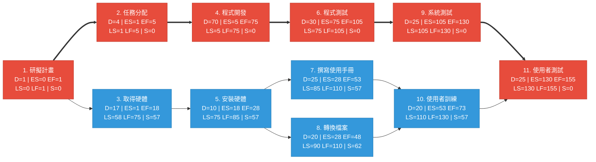

# 作業2：PERT/CPM 網路圖、甘特圖與關鍵路徑分析

## 一、任務清單

| 任務 | 說明 | 需時(天) | 前置任務 |
|:----:|------|:--------:|:--------:|
| 1 | 研擬計畫 | 1 | - |
| 2 | 任務分配 | 4 | 1 |
| 3 | 取得硬體 | 17 | 1 |
| 4 | 程式開發 | 70 | 2 |
| 5 | 安裝硬體 | 10 | 3 |
| 6 | 程式測試 | 30 | 4 |
| 7 | 撰寫使用手冊 | 25 | 5 |
| 8 | 轉換檔案 | 20 | 5 |
| 9 | 系統測試 | 25 | 6 |
| 10 | 使用者訓練 | 20 | 7, 8 |
| 11 | 使用者測試 | 25 | 9, 10 |

---

## 二、PERT/CPM 網路圖

> 紅色節點與粗箭頭（`==>`）表示**關鍵路徑**，藍色節點為非關鍵任務。



### 圖例說明

| 符號 | 意義 |
|------|------|
| D | 任務持續時間（Duration） |
| ES | 最早開始時間（Earliest Start） |
| EF | 最早結束時間（Earliest Finish） |
| LS | 最晚開始時間（Latest Start） |
| LF | 最晚結束時間（Latest Finish） |
| S | 寬裕時間（Slack/Float） |
| 🔴 紅色節點 | 關鍵路徑上的任務（Slack = 0） |
| 🔵 藍色節點 | 非關鍵任務（Slack > 0） |
| `==>` 粗箭頭 | 關鍵路徑 |
| `-->` 細箭頭 | 非關鍵路徑 |

---

## 三、甘特圖（Gantt Chart）

```mermaid
gantt
    title 專案甘特圖
    dateFormat  X
    axisFormat Day %s
    tickInterval 10day

    section 關鍵路徑任務
    1. 研擬計畫        :crit, t1, 0, 1d
    2. 任務分配        :crit, t2, 1, 4d
    4. 程式開發        :crit, t4, 5, 70d
    6. 程式測試        :crit, t6, 75, 30d
    9. 系統測試        :crit, t9, 105, 25d
    11. 使用者測試     :crit, t11, 130, 25d

    section 非關鍵路徑任務
    3. 取得硬體        :t3, 1, 17d
    5. 安裝硬體        :t5, 18, 10d
    7. 撰寫使用手冊    :t7, 28, 25d
    8. 轉換檔案        :t8, 28, 20d
    10. 使用者訓練     :t10, 53, 20d
```



---

## 四、關鍵路徑分析（Critical Path）

### 關鍵路徑

```
1 (研擬計畫) → 2 (任務分配) → 4 (程式開發) → 6 (程式測試) → 9 (系統測試) → 11 (使用者測試)
```

**專案總工期：155 天**

### 關鍵路徑時程計算

| 任務 | 說明 | 開始(天) | 結束(天) | 持續(天) |
|:----:|------|:--------:|:--------:|:--------:|
| 1 | 研擬計畫 | 0 | 1 | 1 |
| 2 | 任務分配 | 1 | 5 | 4 |
| 4 | 程式開發 | 5 | 75 | 70 |
| 6 | 程式測試 | 75 | 105 | 30 |
| 9 | 系統測試 | 105 | 130 | 25 |
| 11 | 使用者測試 | 130 | 155 | 25 |

**合計：1 + 4 + 70 + 30 + 25 + 25 = 155 天**

---

## 五、完整時程表（所有任務的開始與結束時間）

| 任務 | 說明 | 需時 | 前置任務 | ES | EF | LS | LF | Slack | 關鍵? |
|:----:|------|:----:|:--------:|:--:|:--:|:--:|:--:|:-----:|:-----:|
| 1 | 研擬計畫 | 1 | - | 0 | 1 | 0 | 1 | 0 | ✅ |
| 2 | 任務分配 | 4 | 1 | 1 | 5 | 1 | 5 | 0 | ✅ |
| 3 | 取得硬體 | 17 | 1 | 1 | 18 | 58 | 75 | 57 | ❌ |
| 4 | 程式開發 | 70 | 2 | 5 | 75 | 5 | 75 | 0 | ✅ |
| 5 | 安裝硬體 | 10 | 3 | 18 | 28 | 75 | 85 | 57 | ❌ |
| 6 | 程式測試 | 30 | 4 | 75 | 105 | 75 | 105 | 0 | ✅ |
| 7 | 撰寫使用手冊 | 25 | 5 | 28 | 53 | 85 | 110 | 57 | ❌ |
| 8 | 轉換檔案 | 20 | 5 | 28 | 48 | 90 | 110 | 62 | ❌ |
| 9 | 系統測試 | 25 | 6 | 105 | 130 | 105 | 130 | 0 | ✅ |
| 10 | 使用者訓練 | 20 | 7, 8 | 53 | 73 | 110 | 130 | 57 | ❌ |
| 11 | 使用者測試 | 25 | 9, 10 | 130 | 155 | 130 | 155 | 0 | ✅ |

### 計算方法說明

- **Forward Pass（前推法）**：從起點開始，計算每個任務的最早開始時間（ES）與最早結束時間（EF = ES + Duration）。若有多個前置任務，ES = max(所有前置任務的 EF)。
- **Backward Pass（後推法）**：從終點回推，計算每個任務的最晚結束時間（LF）與最晚開始時間（LS = LF - Duration）。若有多個後續任務，LF = min(所有後續任務的 LS)。
- **Slack（寬裕時間）**：Slack = LS - ES = LF - EF。Slack = 0 的任務即為關鍵任務。
- **Critical Path（關鍵路徑）**：所有 Slack = 0 的任務串聯而成的最長路徑，決定了專案最短工期。
